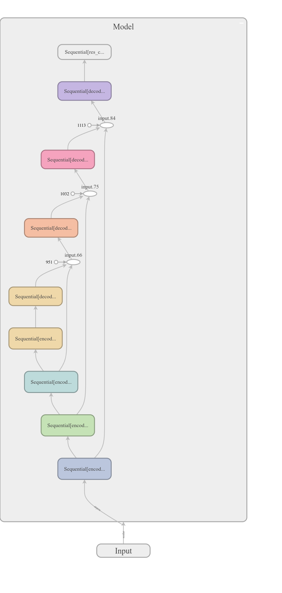
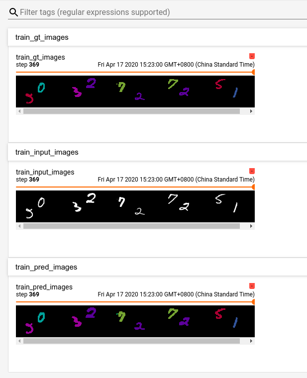

# m2nist-segmentation
利用小型数据集m2nist练习分割

## pytorch版本    
基于MobileNet倒残差模块和LinkNet网络思想，编码阶段4次下采样，解码阶段4次上采样，恢复到原始尺寸   

  

    

 
## tensorflow版本   
略   
 
## 文件结构说明
```
./m2nist-segmentation
├── down_data.py   -- 数据集下载、预览以及划分训练集和验证集
├── LICENSE
├── m2nist          -- 存放下载的数据集m2nist
├── pytorch         -- pytorch版本的分割代码
│   ├── config.yaml -- 配置文件
│   ├── layers.py
│   ├── m2nistDataSet.py    -- 数据加载模块
│   ├── Model.py            -- 模型结构
│   ├── predict.py
│   ├── train.py
│   └── utils_torch.py
├── README.md
└── tf              -- tensorflow版本的分割代码
    ├── common.py
    ├── config.yaml -- 配置文件
    ├── Data_provider.py
    ├── evaluator.py
    ├── model.py
    ├── predict.py
    ├── train_log
    └── utils.py
```